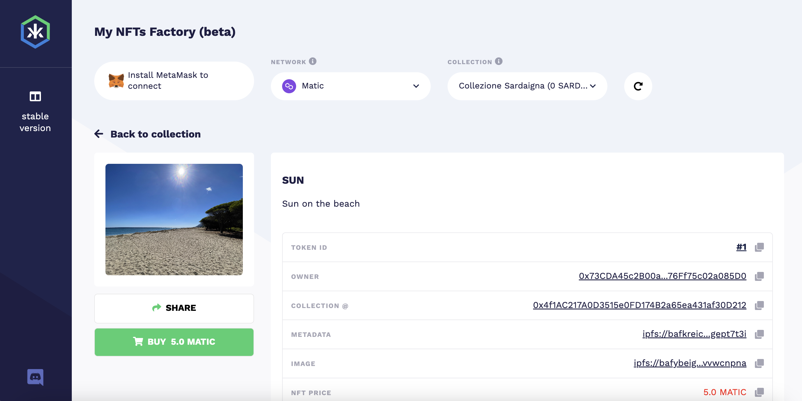

# Sell your NFTs easily

In the DAPP Kredeum, you can list all your NFTs:

View 1

<figure><figcaption></figcaption></figure>

View 2

<figure><figcaption></figcaption></figure>

View 3

<figure><figcaption></figcaption></figure>

Open an NFT:

<figure><figcaption></figcaption></figure>

This NFT URL can be shared:  [https://app.kredeum.com/#/matic/0x4f1AC217A0D3515e0FD174B2a65ea431af30D212/1](https://app.kredeum.com/#/matic/0x4f1AC217A0D3515e0FD174B2a65ea431af30D212/1) &#x20;

You can manage to sell or not the NFT directly on this page. If NFT is on sale, users can come on this page and buy it directly !&#x20;

You can share this NFT in 4 ways:

1. copy / paste the NFT link to sell / buy the NFT on Kredeum
2. copy / paste the OpenSea link to sell / buy the NFT on OpenSea
3. copy / paste inside a wordpress site the NFT buy / sell button shortcode
4. copy / paste inside a wordpress site the NFT collection buy / sell button shortcode

Click on "Share" button and select the best way for you:

<figure><figcaption></figcaption></figure>

You can manage to sell or not this NFT. In above screenshot the NFT is on sale at 3 Matic. Click on "On Sale" button to change the NFT price ("Modify Listing") or remove from Sale :

<figure><figcaption></figcaption></figure>

After removing from Sale:

<figure><figcaption></figcaption></figure>

Click on Sell to redefine a price and start selling again !&#x20;

<figure><figcaption></figcaption></figure>

Price has been updated:

<figure><figcaption></figcaption></figure>

Share your NFT link so a user can buy it:

&#x20;

<figure><figcaption></figcaption></figure>

You can also directly integrate your NFT into your wordpress site to sell easily as described [https://app.gitbook.com/s/-MXghKsRcdBEeU2zsFdI/\~/changes/58/sell-your-nfts-on-your-sites](../sell-your-nfts-on-your-sites/)

